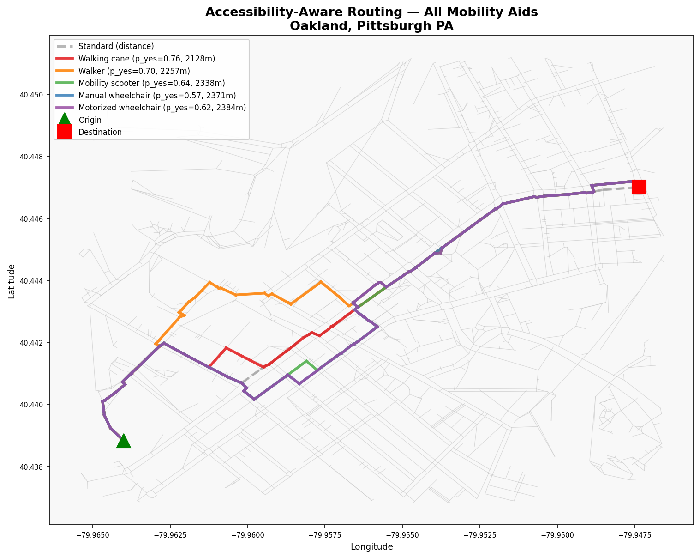

# Human-Aligned Sidewalk Accessibility Perception

**Soft-label learning from 829 mobility aid users for calibrated risk-aware routing**

> Paper under review at CoRL 2026.



---

## Overview

A shared autonomous vehicle preparing for a curbside drop-off must answer a question the onboard map almost never resolves: *is the adjacent sidewalk passable for this passenger's specific mobility aid?*

Two wheelchair users examining the same cracked sidewalk can reach opposite conclusions — not from labeling error, but from real differences in equipment and risk tolerance. We treat this disagreement as signal.

From **49,490 ternary votes (yes/unsure/no)** by **829 mobility-aid users** on 52 Google Street View scenes via [Project Sidewalk](https://projectsidewalk.io/), we derive per-aid empirical vote distributions over {no, unsure, yes}. A frozen vision encoder + per-aid linear probe trained by **KL divergence against these distributions** achieves a soft Brier score of **0.076** (mean across 8 backbones) — a **3.2× calibration improvement** over standard cross-entropy that holds for every encoder tested.

The calibrated per-aid probabilities are composed as OSM edge costs in a Pittsburgh pedestrian graph, producing **five genuinely different optimal routes** for five mobility aids from the same origin-destination pair, and achieving higher model-predicted passability than OpenRouteService on every aid — including the 20% of OD pairs where ORS returns no path at all.

---

## Key results

### Calibration is the operative metric

The routing objective is linear in p̂_yes — so Hard-CE's overconfidence directly collapses the planner's routing gradient. Soft-KL preserves the empirical bimodality and gives the planner a usable continuous risk signal.

| Method | F1 (Soft-KL) | F1 (Hard-CE) | Brier Soft-KL ↓ | Brier Hard-CE ↓ | Ratio | Latency (ms) |
|--------|-------------|-------------|----------------|----------------|-------|-------------|
| CLIP ViT-B/32 | 0.530 | **0.617** | **0.064** | 0.231 | 3.6× | 61.6 |
| CLIP ViT-B/16 | 0.499 | 0.544 | 0.080 | 0.239 | 3.0× | 60.9 |
| CLIP ViT-L/14 | 0.531 | 0.595 | 0.080 | 0.230 | 2.9× | 85.4 |
| DINOv2-base | 0.496 | 0.614 | 0.080 | 0.238 | 3.0× | 60.5 |
| **DINOv2-large** | **0.613** | 0.613 | 0.075 | 0.253 | 3.4× | **78.5** |
| SigLIP2-base | 0.502 | 0.596 | 0.082 | 0.228 | 2.8× | 61.1 |
| SigLIP2-SO400M | 0.579 | 0.555 | 0.066 | 0.256 | 3.9× | 101.6 |
| ViT-B/16-sup | 0.482 | 0.573 | 0.083 | 0.274 | 3.3× | 64.4 |
| **Probe mean** | 0.529 | **0.588** | **0.076** | 0.244 | **3.2×** | — |
| | | | | | | |
| *Zero-shot VLMs (no task-specific data)* | | | | | | |
| Qwen3-VL-8B | — | 0.576 | — | 0.468 | — | 5,919 |
| LLaVA-1.5-7B | — | 0.418 | — | 0.423 | — | 292 |
| Qwen2.5-VL-7B | — | 0.412 | — | 0.632 | — | 522 |

Key findings:
- The **3.2× Brier improvement** is consistent across every backbone and outside the 95% CI for all eight pairings
- Post-hoc temperature scaling reduces Hard-CE Brier by ~34% but leaves a >2× gap vs Soft-KL — the advantage is structural (target encoding), not just overconfidence
- DINOv2-large leads Soft-KL; CLIP-B/32 leads Hard-CE — the ranking **inverts** between objectives, showing that DINOv2's dense self-supervised features better capture accessibility uncertainty while CLIP's language-aligned priors better predict plurality labels
- **Walking cane Hard-CE failure:** 6/8 encoders fall below the trivial majority-class baseline. Soft-KL on DINOv2-large recovers F1 = 0.640 (+42% relative) by preserving the empirical bimodality that Hard-CE erases
- Best zero-shot VLM (Qwen3) trails our probe by **6.2× in Brier** and **~75× in latency**

### Routing — Pittsburgh PA (Forbes/Murray corridor)

91.7% of OSM edges scored with real DINOv2-large predictions (vs 40.4% with PS GPS labels alone); remaining 8.3% use population-level priors. Barrier cost β_c=8 (Pareto curve inflection).

**Canonical OD pair:**

| Mobility Aid | Std. p̄_yes | Acc. p̄_yes | Δp_yes | Δdist |
|-------------|-----------|-----------|-------|------|
| Walking cane | 0.516 | 0.671 | +0.155 | +25% |
| Walker | 0.486 | 0.630 | +0.144 | +25% |
| Mobility scooter | 0.459 | 0.600 | +0.141 | +18% |
| Manual wheelchair | 0.442 | 0.576 | +0.134 | +19% |
| Motorized wheelchair | 0.446 | 0.592 | +0.146 | +25% |

**Monte Carlo — 10,000 random OD pairs** (min 200 m separation, seed 42):

| Aid | Mean Δp̄_yes | Median | % trips improved | Mean Δdist |
|-----|------------|--------|-----------------|-----------|
| Walking cane | +0.065 | +0.055 | 87.8 ± 0.6% | +7.4% |
| Walker | +0.081 | +0.074 | 88.2 ± 0.6% | +8.2% |
| Mobility scooter | +0.102 | +0.096 | 91.0 ± 0.6% | +8.6% |
| Manual wheelchair | +0.120 | +0.112 | 90.9 ± 0.6% | +9.8% |
| Motorized wheelchair | +0.116 | +0.110 | 90.8 ± 0.6% | +9.8% |

**vs. OpenRouteService wheelchair profile** (40 routable pairs out of 50; ORS fails on 20%):

| Aid | p̄_yes ORS | p̄_yes Ours | Δ (95% CI) |
|-----|-----------|-----------|-----------|
| Walking cane | 0.712 | **0.748** | +0.036 ± 0.018 |
| Walker | 0.634 | **0.668** | +0.034 ± 0.020 |
| Mobility scooter | 0.585 | **0.625** | +0.040 ± 0.019 |
| Manual wheelchair | 0.519 | **0.566** | +0.047 ± 0.022 |
| Motorized wheelchair | 0.545 | **0.590** | +0.045 ± 0.022 |

### Geographic transfer (DINOv2-large, binary CurbRamp, unseen cities)

Model trained on Seattle; evaluated zero-shot on Project Sidewalk images from 5 cities (484 total).

| City | Region | n | Balanced Acc. | Above chance |
|------|--------|---|--------------|-------------|
| Zurich | Europe | 89 | 0.616 | +11.6 pp |
| Detroit | N. America | 91 | 0.570 | +7.0 pp |
| Pittsburgh | N. America | 162 | 0.566 | +6.6 pp |
| Taipei | E. Asia | 95 | 0.518 | +1.8 pp ⚠️ |
| Los Angeles | N. America | 47 | 0.507 | +0.7 pp |

Taipei near-chance performance surfaces the Western-centric data limit. Operational rejection criterion: suppress the map-prior where transfer balanced accuracy ≤ 0.55.

---

## Repository structure

```
sidewalk-accessibility-project/
│
├── src/
│   ├── data/
│   │   ├── firebase.py               # Parse Firebase JSONL → votes CSV
│   │   └── preprocess.py             # Tally votes → per-(image×aid) distributions
│   ├── segmentation/
│   │   ├── deproject.py              # GSV panorama → rectified 90° crops
│   │   ├── segment.py                # YOLOv12-seg mask extraction
│   │   └── verify.py                 # Area-ratio filter (A_pred/A_gt ∈ [0.7,1.3])
│   ├── models/
│   │   ├── train.py                  # Linear probe training (Soft-KL + Hard-CE)
│   │   ├── crossval.py               # 5-fold panorama-level cross-validation
│   │   ├── train_final_model.py      # Train on full dataset (for deployment)
│   │   ├── infer.py                  # Single-image inference
│   │   ├── zero_shot.py              # VLM zero-shot evaluation
│   │   ├── latency_benchmark.py      # Encoder + VLM latency measurement
│   │   ├── error_analysis.py         # Per-aid error analysis (walking cane)
│   │   ├── compute_vlm_brier.py      # Soft Brier scores for VLM predictions
│   │   ├── plot_results.py           # Publication figures (Fig 1–5)
│   │   └── summarize_cv.py           # CV results summary table
│   ├── routing/
│   │   ├── fetch_ps_labels.py        # Download Project Sidewalk GPS labels
│   │   ├── score_osm_edges.py        # Snap PS labels → OSM graph edges
│   │   ├── demo.py                   # Accessibility-aware routing (Dijkstra)
│   │   ├── monte_carlo.py            # Monte Carlo routing stability (10k OD pairs)
│   │   └── plot_barrier_cost_pareto.py # Pareto curve: accessibility vs distance
│   └── generalization/
│       ├── download_city_images.py   # Download GSV thumbnails for new cities
│       ├── evaluate_generalization.py # Out-of-distribution evaluation
│       └── plot_generalization.py    # Generalization figures
│
├── data/
│   ├── processed/
│   │   ├── tallies_firebase.json         # 260 (image×aid) soft-label distributions
│   │   └── image_selection_firebase.csv  # 49,490 raw votes, 829 participants
│   └── legacy/                           # Pre-Firebase pipeline data (Nov 2025)
│
├── checkpoints/
│   └── yolo/bestv12.pt               # YOLOv12-seg checkpoint (sidewalk segmentation)
│
├── results/
│   ├── cv/{soft_kl,hard_ce}/         # CV results per encoder (JSON + logs)
│   ├── zero_shot/                    # VLM zero-shot results + Brier comparison
│   ├── figures/                      # Publication figures (PDF + PNG)
│   ├── generalization/               # Out-of-distribution results
│   ├── routing/                      # Routing figures + Pareto curve
│   ├── error_analysis/               # Walking cane analysis
│   └── latency/                      # Latency benchmark results
│
├── tests/
│   └── test_preprocess.py
│
├── paper/                            # LaTeX manuscript + figures
│
├── run_cv.sh                         # Run 5-fold CV for all 8 encoders
├── run_zero_shot.sh                  # Run VLM zero-shot evaluation
├── run_latency.sh                    # Run latency benchmark
├── run_prompt_sensitivity.sh         # Run prompt sensitivity analysis (3×3)
├── run_generalization.sh             # Run generalization evaluation
└── run_routing_demo.sh               # Full routing pipeline
```

---

## Setup

**Requirements:** Python 3.11+, CUDA GPU recommended (experiments run on a single A100 40 GB).

```bash
git clone https://github.com/wesleymaia999/sidewalk-accessibility-project.git
cd sidewalk-accessibility-project
python3.11 -m venv venv
source venv/bin/activate
pip install -r requirements.txt
```

**Data:** Place Project Sidewalk data in `data/processed/`:
- `tallies_firebase.json` — per-(image×aid) vote distributions (260 rows)
- `image_selection_firebase.csv` — raw votes (49,490 rows, 829 participants)
- Sidewalk crop images in `data/images/sidewalk-images/`

---

## Reproducing experiments

All scripts write results to `results/` and accept a `WANDB_PROJECT` env var for experiment tracking.

### Cross-validation (main results)

```bash
# Soft-KL — paper method (all 8 encoders × 5 folds)
./run_cv.sh

# Hard-CE baseline
LOSS_TYPE=hard_ce ./run_cv.sh
```

Results → `results/cv/{soft_kl,hard_ce}/<encoder>/cv_results.json`

### Zero-shot VLM evaluation

```bash
./run_zero_shot.sh
```

Results → `results/zero_shot/<model>/zero_shot_results.json`

### Brier score comparison (probe vs VLMs)

```bash
python src/models/compute_vlm_brier.py \
    --results results/zero_shot/qwen3-vl-8b/zero_shot_results.json \
              results/zero_shot/qwen2.5-vl-7b/zero_shot_results.json \
              results/zero_shot/llava-1.5-7b/zero_shot_results.json \
    --output  results/zero_shot/vlm_brier_comparison.json
```

### Latency benchmark

```bash
./run_latency.sh
```

Results → `results/latency/latency_results.json`

### Generalization to unseen cities

```bash
# 1. Download images
python src/generalization/download_city_images.py \
    --city pittsburgh --n_per_class 125 \
    --output_dir data/generalization/images/pittsburgh \
    --append_csv data/generalization/test_images.csv

# 2. Evaluate
./run_generalization.sh dinov2-large results/models/dinov2-large
```

Results → `results/generalization/dinov2-large/agreement_summary.json`

### Accessibility-aware routing

```bash
./run_routing_demo.sh
```

Runs the full pipeline: fetch Project Sidewalk Pittsburgh labels → score OSM edges → Dijkstra routing → barrier cost ablation → Monte Carlo over 10,000 OD pairs.

Results → `results/routing/`

### Publication figures

```bash
python src/models/plot_results.py
```

Generates Figures 1–5 in `results/figures/`.

---

## Citation

```bibtex
@inproceedings{maia2026sidewalk,
  title     = {Human-Aligned Sidewalk Accessibility Perception: Soft-Label Learning
               from 829 Mobility Aid Users for Autonomous Mobility Services},
  author    = {Maia, Wesley and {others}},
  booktitle = {Conference on Robot Learning (CoRL)},
  year      = {2026},
}
```

---

## Acknowledgments

- Crowdsourced labels collected via [Project Sidewalk](https://projectsidewalk.io/) (Saha et al., CHI 2019)
- Street View thumbnails via Google Street View Static API
- Pedestrian routing graphs via [OSMnx](https://github.com/gboeing/osmnx)
